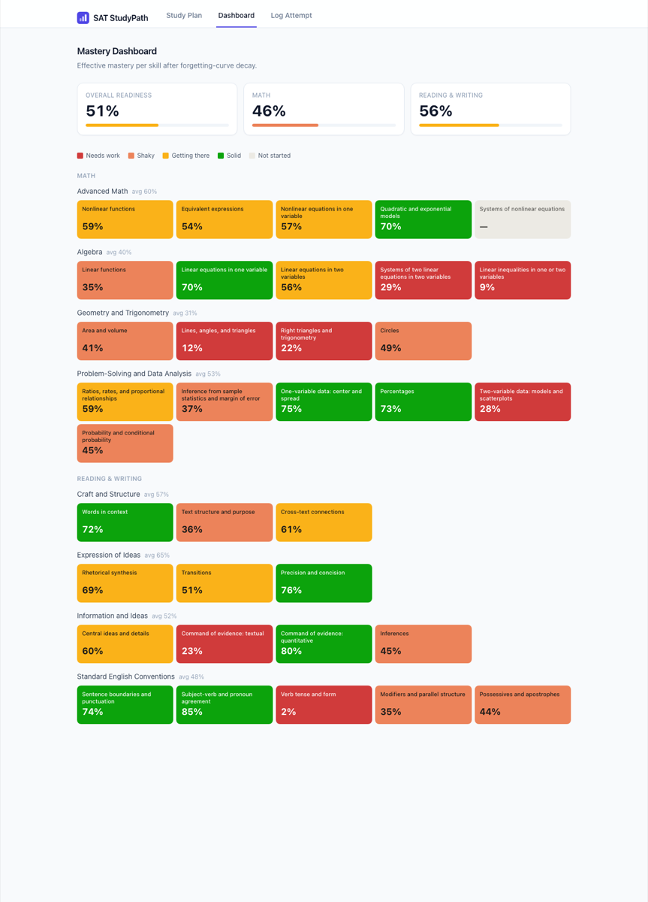

# SAT StudyPath

**A personalized SAT study-path generator.** It takes a student's practice
results *by topic* and produces a ranked "what to study next" plan using an
actual adaptive algorithm — recency-weighted mastery scoring, forgetting-curve
decay, and real digital-SAT topic-frequency weighting — not a static checklist.

<p align="center">
  
  
</p>

## Why I built this

I ran an SAT tutoring channel — 60+ videos, 5M+ views — and the question I got
most often wasn't *"how do I solve this?"* It was **"what should I study next?"**

Most prep tools answer that with a static checklist or a raw accuracy number.
Neither captures the two things that actually move a score:

1. **A skill fades if you don't practise it.** Nailing linear functions three
   weeks ago and not touching them since is *not* the same as nailing them
   yesterday — but an all-time accuracy stat treats them identically.
2. **Not all topics are worth the same.** Missing 20% of linear-equation
   questions costs far more points than missing 20% of a topic that shows up
   twice a test.

StudyPath does it properly. The recommendation engine
([`backend/app/algorithm/`](backend/app/algorithm/)) is a real piece of
software — four modules of pure, unit-tested functions — not a wrapper around a
spreadsheet. The [How the recommendation algorithm
works](#how-the-recommendation-algorithm-works) section below is the part worth
reading.

## Architecture

```
 React + Vite + TypeScript            FastAPI                     SQLAlchemy 2.0
 ─────────────────────────  ──HTTP──▶  ───────────────────────▶   ─────────────▶  SQLite
 Study Plan · Dashboard ·             app/routers/   (thin)                       (Postgres:
 Log Attempt   (Tailwind)             app/services/  (ORM ⇄ algorithm glue)        one line
                                      app/algorithm/ (the engine — no DB,          in config)
                                                      no clock, pure functions)
```

| Layer | What lives there | Why it's separate |
|---|---|---|
| [`app/algorithm/`](backend/app/algorithm/) | `mastery` · `decay` · `priority` · `readiness` | Pure functions — take plain values and an explicit `now`, return numbers/dataclasses. Tested against hand-computed values with no database or server running. |
| [`app/services/`](backend/app/services/) | `record_attempt` (the one write path), `topic_snapshots` (the one ORM→algorithm projection), `seeding` | Both the seed script and `POST /api/attempts` fold attempts into mastery through *one* function, so the update rule exists in exactly one place. |
| [`app/routers/`](backend/app/routers/) | `topics` · `attempts` · `mastery` · `study_plan` | Thin HTTP handlers; all the logic is a layer down. |
| [`frontend/src/`](frontend/src/) | `pages/` · `components/` · `api/` (typed fetch client) | Talks to the API over a relative `/api` path; Vite proxies it in dev. |

## How the recommendation algorithm works

Three ideas, applied in order. Constants below are the live values from
[`app/algorithm/`](backend/app/algorithm/).

### 1. Mastery is an exponentially weighted moving average — not lifetime accuracy

A student's skill *changes over time* — that's the whole point of studying. A
plain average of every attempt they've ever made lets a rough first week drag
down a topic they've since mastered. So each attempt nudges the estimate a fixed
fraction of the way toward that attempt's outcome:

```
outcome      = 1.0 if correct else 0.0
new_mastery  = old_mastery + 0.3 * (outcome - old_mastery)      # learning rate 0.3
```

The influence of any one attempt decays geometrically as newer attempts arrive —
recent performance dominates without old attempts being thrown away. A topic with
no attempts starts at **0.4** (slightly below neutral: with no evidence, assume
*not yet competent*), and a separate `confidence` value climbs to 1.0 over the
first five attempts so the UI can distinguish "34%" from "34%, but we've only
seen it twice".

### 2. Forgetting-curve decay — applied when the number is read, not when it's stored

Ebbinghaus's forgetting curve models retention as exponential decay over elapsed
time. StudyPath applies exactly that at read time:

```
decayed_mastery = mastery_score * exp(-0.02 * days_since_practice)
```

A week untouched costs ~13% of a skill; a month, ~45%. This is deliberately
**not** persisted — the stored score always means "how well you did when you last
practised," and decay is a lens laid over it. Practising again writes a fresh
score *and* resets the clock, so a quick review session restores most of the lost
ground.

### 3. Priority = points at risk + a nudge toward blind spots

```
urgency          = 1 - decayed_mastery
exploration_bonus = 0.15 / (1 + attempts_count)
priority_score    = frequency_weight * urgency  +  exploration_bonus
```

`frequency_weight * urgency` is the **expected-points-at-risk** term: a shaky
skill that's all over the test outranks a shaky skill that barely appears.
(`frequency_weight` is each skill's share of its section — seeded from College
Board's published domain weightings plus my own read of the question mix across
released tests; see [`taxonomy.py`](backend/app/data/taxonomy.py).)

The **exploration bonus** is a separate additive term so a never-attempted topic
still surfaces even with zero evidence it's weak — you can't improve what you
never diagnose. It's 0.15 at zero attempts and decays as `1/(1+n)`, so it's
negligible within a few reps.

Each recommendation ships with a plain-English reason string built from the same
numbers:

> *Mastery 36% (decayed from 47%) · appears in ~9% of the Reading & Writing
> section · last practiced 13 days ago*

### The property I care about: spaced repetition falls out for free

Take a skill sitting at 90% mastery.

| State | decayed mastery | priority score |
|---|---|---|
| practised today | 90% | ≈ 0.025 |
| untouched for 30 days | 49% | ≈ 0.057 |

The priority **more than doubles** with no new data — purely from decay. A fresh
skill at 62% mastery scores ≈ 0.047, so after a month of neglect the
strong-but-stale skill climbs back *above* the mediocre-but-fresh one. Nobody
coded "remind me to review things"; it emerges from decay + urgency. That
behaviour has a dedicated test:
[`test_high_mastery_but_stale_is_pushed_back_up_by_decay`](backend/app/tests/test_mastery_engine.py).

## Running it

Clean clone to running app in a couple of minutes. Requires **Python 3.11+**
(3.13 recommended) and **Node 20+**.

### Backend — `http://localhost:8000`

```bash
cd backend
python3 -m venv .venv && source .venv/bin/activate
pip install -r requirements.txt

python -m app.seed                # create the DB + a synthetic ~4-week history
uvicorn app.main:app --reload     # API + interactive docs at /docs
```

<details><summary>Prefer <a href="https://docs.astral.sh/uv/">uv</a>?</summary>

```bash
cd backend
uv venv && uv pip install -r requirements.txt
uv run python -m app.seed
uv run uvicorn app.main:app --reload
```
</details>

### Frontend — `http://localhost:5173`

```bash
cd frontend
npm install
npm run dev                       # proxies /api to :8000
```

Nothing to seed by hand if you skip `python -m app.seed` — the empty state has a
**Load demo data** button that hits the (dev-only) seed endpoint.

### Tests

```bash
cd backend && pytest               # 80 tests
```

[`app/tests/test_mastery_engine.py`](backend/app/tests/test_mastery_engine.py) is
the one to read: 48 cases with the arithmetic worked out in comments next to each
assertion, covering every ranking edge case (never-attempted surfaces via
exploration; perfect-and-fresh sinks; stale-and-strong resurfaces; ties break by
frequency weight).

## API

| method | path | purpose |
|---|---|---|
| `GET`  | `/api/topics` | the full 35-skill taxonomy |
| `GET`  | `/api/mastery` | every skill's mastery / decay / confidence + readiness roll-up |
| `GET`  | `/api/study-plan?limit=5` | ranked recommendations with reason strings |
| `POST` | `/api/attempts` | log one attempt `{topic_id, correct, time_taken_seconds, difficulty}`; returns the updated mastery |
| `POST` | `/api/topics/seed` | dev only — (re)generate the synthetic history |

## Data & content policy

No real College Board question text, answer choices, or passages appear anywhere
in this project — **only skill tags, correctness, timing, and difficulty**. The
seed script generates entirely synthetic attempts (`topic=Linear Functions,
correct=false, 47s`, never any question content). Topic-frequency weights are
approximate and tutor-informed, not scraped from any proprietary source.

## What I'd build next

- **CSV bulk upload** — paste a full practice-session breakdown instead of one
  attempt at a time (`POST /api/attempts/bulk`, already stubbed in the endpoint
  list).
- **Readiness-over-time chart** — persist a daily readiness snapshot and plot the
  trend; the roll-up already exists, it just isn't stored.
- **Per-topic resource links** — the `Resource` model is in the schema; wire a
  small admin list and surface "watch/read this" on each study-plan card.
- **Calibrated scaled score** — map the 0–1 readiness number onto the 400–1600
  scale using real concordance data.
- **Multi-user** — add auth and scope every query by user; the write path and
  snapshot projection are already the only two places that would need to change.
- **Deploy** — Render/Railway for the API (swap SQLite → Postgres, one line),
  Vercel for the frontend.
