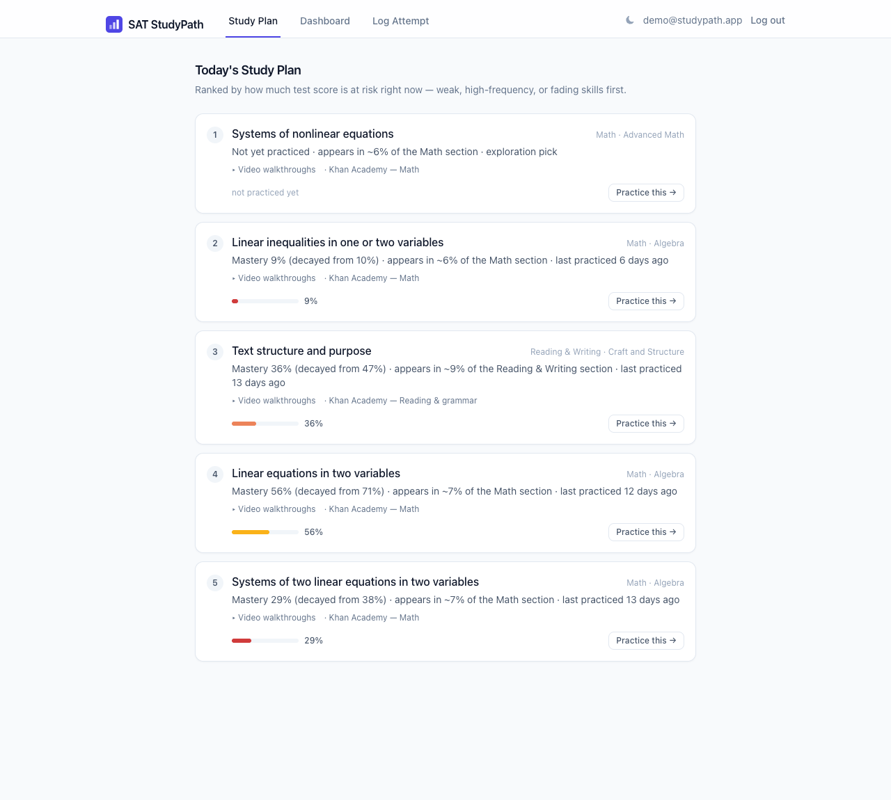
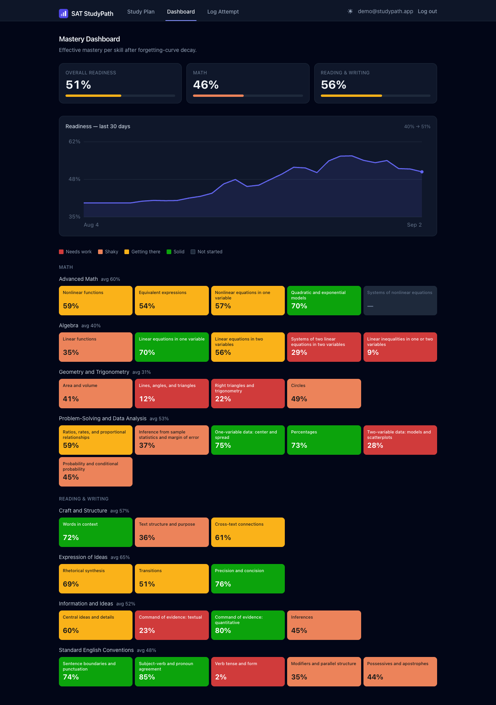

# SAT StudyPath

SAT StudyPath takes your practice results by topic and tells you what to study next. It ranks every skill by how much score you could lose on the exam due to various contributing factors.

The ranking runs on an algorithm that tracks how well you know each skill, fades that number over time when you stop practicing, and weights everything by how often the skill shows up on the test.

<p align="center">
  
  
</p>

## Why I built this

I ran an SAT tutoring channel and the question students asked most were not "how do I solve this problem" but was "what should I study next?"

Most prep tools answer that poorly. They give you a checklist or a raw accuracy percentage, and neither one deals with the two things that actually move your score.

Skills fade when you don't practice consistently. You nailed linear functions three weeks ago and have not touched them since. That is not the same as nailing them yesterday. Your lifetime accuracy number treats both cases as identical.

The other thing is that topics are not all worth the same. Missing 20 percent of the linear equation questions costs you far more than missing 20 percent of a topic that shows up once or twice a test.

StudyPath does both. The scoring code is in `backend/app/algorithm/` and there is a test suite that checks the numbers by hand. The next section walks through how it works.

## How the recommendation algorithm works

There are three parts and they run in that order. The numbers below are the actual constants from the code.

### Mastery is a moving average, not lifetime accuracy

Your skill level changes while you study, so a plain average of everything you have ever done is not that useful. One rough week early on would drag down a topic you have since gotten good at.

Instead, each attempt moves the estimate part of the way toward that result.

```
outcome     = 1.0 if correct else 0.0
new_mastery = old_mastery + 0.3 * (outcome - old_mastery)   # learning rate 0.3
```

Recent attempts count for the most and older ones fade out, but nothing gets thrown away completely. If you have never done a topic it starts at 0.4, a bit below the middle, since with nothing to go on it is safer to assume you are not ready. There is also a confidence value that climbs to 1.0 over your first five attempts, so the app can tell the difference between 34 percent after two questions and 34 percent after twenty.

### Forgetting curve decay, applied when the app reads the number

Your memory of a skill decays over time. Ebbinghaus modeled that as exponential decay and StudyPath does the same.

```
decayed_mastery = mastery_score * exp(-0.02 * days_since_practice)
```

A week without practice costs you about 13 percent of a skill, and a month costs about 45 percent.

The saved score itself does not change from decay. It always means how well you did the last time you practiced. The decay only gets applied when the app reads that number, not when it writes it. Practice the topic again and you get a fresh score and the clock resets, so a quick review session gets most of the drop back.

### Priority is points at risk plus a nudge toward blind spots

```
urgency           = 1 - decayed_mastery
exploration_bonus = 0.15 / (1 + attempts_count)
priority_score    = frequency_weight * urgency + exploration_bonus
```

`frequency_weight * urgency` is roughly the points you have at risk. A weak skill that is all over the test ranks higher than a weak skill that barely comes up. `frequency_weight` is each skill's share of its section, and I set those from College Board's published domain weights plus my own read of the question mix on released tests. They are in `backend/app/data/taxonomy.py`.

The exploration bonus is added on separately. It pushes a topic you have never done up the list even though there is no data saying it is weak, because you cannot work on a gap you do not know about. It starts at 0.15 with zero attempts and falls off fast once you have done a few.

Every recommendation comes with a reason string built from the same numbers.

> Mastery 36 percent, down from 47 percent. Shows up in about 9 percent of the Reading and Writing section. Last practiced 13 days ago.

### Spaced repetition falls out of this for free

Say you have a skill at 90 percent mastery.

Practice it today and the decayed mastery stays at 90 percent, so its priority score is about 0.025. Leave it alone for 30 days and the decayed mastery drops to 49 percent, so the priority score climbs to about 0.057.

The priority more than doubled and nothing new happened, that is just the decay. A skill that is genuinely at 62 percent and fresh scores about 0.047, so after a month of ignoring the 90 percent skill it ends up ranked above the 62 percent one. I never wrote any "review this" logic, it just falls out of decay and urgency. There is a test for exactly this case called `test_high_mastery_but_stale_is_pushed_back_up_by_decay`.

### The readiness trend is rebuilt, not stored

`GET /api/progress` does not keep daily snapshots anywhere. It takes your whole history, runs the moving average forward from the start, and works out your decay adjusted readiness for each day. That code is in `backend/app/algorithm/progress.py`, and it stays fast because it only walks the history once.

If the chart dips while you are on a study break, that is the forgetting curve with no new practice pushing against it. It is the same math, just shown over time.

## Architecture

The frontend is React with Vite and TypeScript. The backend is FastAPI and SQLAlchemy. It runs on SQLite locally and Postgres in production, and switching between them is one line in the config.

The backend is split into a few layers.

The scoring math lives in `backend/app/algorithm/`. These are plain functions that take numbers and return numbers, which means you can test them without a database or a server running. There is one file per part of the algorithm, so mastery, decay, priority, readiness and progress.

`backend/app/services/` is the glue between the database and the algorithm. The two functions that matter are `record_attempt`, which is the single place anything gets written so the update rule only exists once, and `topic_snapshots`, which is the single place database rows get turned into algorithm input.

`backend/app/routers/` is the HTTP layer and it is kept thin. Anything that reads or writes your data goes through `get_current_user` in `backend/app/auth.py` first.

`frontend/src/` is the usual React layout of pages and components, plus an api folder for talking to the backend and an auth folder that holds the token.

Anyone can make an account and auth runs on JWT tokens. The app has three screens. Study Plan is the ranked list, and each item links out to resources for that topic and to a form for logging practice on it. Dashboard has the readiness chart and the heatmap. Log Attempt is where you record a question, one at a time or as a CSV of a whole session.

## Running it

You need Python 3.11 or newer and Node 20 or newer. From a fresh clone it takes a couple of minutes to get running.

The backend runs on `http://localhost:8000`.

```bash
cd backend
python3 -m venv .venv && source .venv/bin/activate
pip install -r requirements.txt

python -m app.seed
uvicorn app.main:app --reload
```

The seed sets up a demo account you can log into with `demo@studypath.app` and `demopassword`, or you can hit "Try the demo account" on the login page. Your own account starts empty.

There is a uv version of these commands too.

<details><summary>uv commands</summary>

```bash
cd backend
uv venv && uv pip install -r requirements.txt
uv run python -m app.seed
uv run uvicorn app.main:app --reload
```
</details>

The frontend runs on `http://localhost:5173`.

```bash
cd frontend
npm install
npm run dev
```

The test suite runs with pytest.

```bash
cd backend && pytest
```

That is 118 tests. The one worth reading is `backend/app/tests/test_mastery_engine.py`. It has 52 cases and works the expected number out by hand in a comment next to each check. It covers the ranking edge cases, so a topic you have never done still showing up, a topic you just aced dropping off the list, a strong topic you have ignored for weeks climbing back, and ties getting broken by how common the topic is.

## API

You need a token for anything that touches your data. `/api/topics` and `/api/resources/{topic_id}` are open. Get a token from `/api/auth/login` or `/api/auth/signup`.

`GET /api/topics` returns the full taxonomy of 35 skills.

`GET /api/mastery` returns every skill's mastery, decay, and confidence, plus the readiness rollup.

`GET /api/study-plan?limit=5` returns the ranked recommendations with reason strings and study links.

`GET /api/progress?days=30` returns readiness per day, replayed from your history.

`GET /api/resources/{topic_id}` returns study links for one topic.

`POST /api/attempts` logs one attempt and returns the updated mastery.

`POST /api/attempts/bulk` imports a CSV. Get the format from `GET /api/attempts/template.csv`.

`POST /api/topics/seed` regenerates a synthetic history for the current user. This one is dev only.

## Data and content policy

There is no real College Board question text, answer choices, or passages anywhere in the project. All the database keeps is skill tags, whether you got the question right, how long it took, and the difficulty.

The seed data is made up. A row looks like `topic=Linear Functions, correct=false, 47s` and never holds an actual question. The frequency weights are rough estimates from my own tutoring, nothing scraped or licensed.

## Deployment

The deploy config is checked in. `render.yaml` sets up the FastAPI service and a free Postgres database, `backend/Dockerfile` builds the API, and `frontend/vercel.json` handles the SPA routing and forwards `/api` to the backend.

To move to Postgres you change `DATABASE_URL` and the app picks the right driver on its own, since `backend/app/config.py` cleans up the URL format. That driver only lives in `backend/requirements-prod.txt` so local installs stay light. Setting `SEED_DEMO_ON_STARTUP` to true makes the app rebuild the demo account the first time it boots.

1. API. On Render, choose New, then Blueprint, then this repo. It builds the web service and the database and generates `JWT_SECRET`. Set `CORS_ORIGINS` to the frontend URL once you have it.
2. Frontend. On Vercel, import the repo and set the root directory to `frontend`. Edit the `/api` rewrite in `vercel.json` to point at the Render URL.

## What I'd build next

Turn the 0 to 1 readiness number into a real scaled score in the 400 to 1600 range. That needs concordance data I do not have.

Add refresh tokens. Right now the access token is good for a week, which is longer than it should be.

Recommend a difficulty level per topic, not just the topic. The app already logs accuracy by difficulty so the data is already there.

Real database migrations with Alembic. `create_all` is fine for a clean deploy but not once there is data worth keeping.
